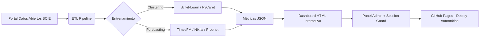

# Laboratorio de Machine Learning: Datos Abiertos del BCIE

[](https://datosabiertos.bcie.org/)
[](models/AUDITORIA_MODELOS.md)
[](models/)
[](app/data/gold/dashboard/)
[](https://unir03d2026-alt.github.io/BCIE_ML_Lab/login/index.html)
[](#-capa-de-seguridad-iso-270012022)

Repositorio oficial de experimentos y pipelines de Machine Learning aplicados a los datos abiertos del Banco Centroamericano de Integración Económica (BCIE). Este proyecto demuestra cómo transformar datos públicos en inteligencia predictiva y segmentación estratégica a través de un **ecosistema completo**: pipelines de entrenamiento, dashboards interactivos, panel de administración con seguridad ISO 27001, y despliegue continuo.

### 

> **Accede al laboratorio desplegado:** [https://unir03d2026-alt.github.io/BCIE_ML_Lab/](https://unir03d2026-alt.github.io/BCIE_ML_Lab/login/index.html)
>
> Credenciales de demostración: `admin` / `UNIR03d`

---

##  Modelos Implementados y Resultados

El laboratorio ha operacionalizado **12 modelos avanzados**, divididos en dos grandes áreas de estudio: Segmentación de Cartera (Clustering) y Proyección de Aprobaciones (Forecasting).

### 1. Segmentación de Cartera (Clustering)

_Objetivo: Identificar perfiles de comportamiento financiero en las aprobaciones del BCIE (1961–2025)._

| Modelo           | Metodología            | Resultado Óptimo      | Perfiles Identificados                                                                                       |
| :--------------- | :--------------------- | :-------------------- | :----------------------------------------------------------------------------------------------------------- |
| **DBSCAN**       | Densidad (Grid Search) | **3 Tiers + Ruido**   | **Tier A:** Regular (Media ~30M)<br>**Tier B:** Alto Valor/Freq (~65M)<br>**Tier C:** Micro Créditos (~441K) |
| **K-Means**      | Particional (Elbow)    | **K=4 Clusters**      | Segmentación rígida equilibrada.                                                                             |
| **K-Medoids**    | Particional (PAM)      | **K=4 Clusters**      | Robustez ante outliers financieros.                                                                          |
| **Hierarchical** | Aglomerativo (Ward)    | **K=4 Clusters**      | Estructura anidada de sub-grupos.                                                                            |
| **GMM**          | Modelos Gaussianos     | **K=4 Componentes**   | Asignación probabilística (soft clustering).                                                                 |
| **Mixed**        | Votación (Ensemble)    | **K=3 Clusters**      | Consenso estable entre algoritmos (Score 0.85).                                                              |
| **HDBSCAN**      | Densidad Adaptativa    | **14 Micro-clusters** | Detección de nichos muy específicos (26% ruido).                                                             |

> **Highlight:** La optimización de **DBSCAN** (`eps=0.25`, `min_samples=10`) logró aislar el 14% de operaciones atípicas (ruido), permitiendo una limpieza automática de la data para análisis estratégicos.

### 2. Proyección de Aprobaciones (Forecasting)

_Objetivo: Predecir volúmenes de aprobación por país y sector._

| Modelo            | Enfoque                    | Metodología                | Desempeño Destacado                       |
| :---------------- | :------------------------- | :------------------------- | :---------------------------------------- |
| **TimesFM**       | **IA Generativa (Google)** | Foundation Model Zero-Shot | **MAPE < 30%** en Costa Rica y Argentina. |
| **StatsForecast** | **Ensemble Estadístico**   | AutoARIMA + Theta (50/50)  | Intervalos de confianza robustos (80%).    |
| **Prophet**       | Modelo Aditivo             | Tendencia + Estacionalidad | Baseline explicable para negocio.          |
| **NeuralProphet** | Híbrido (AR-Net)           | Red Neuronal + Componentes | Captura de no-linealidades complejas.      |

---

##  Dashboards Interactivos (18)

El laboratorio genera automáticamente **18 Dashboards Interactivos** (HTML/Plotly/Chart.js) organizados en tres niveles:

### Dashboard Ejecutivo Unificado

Panel de mando centralizado con KPIs consolidados: **USD $57.4B** en monto total aprobado, 3,139 operaciones, con análisis por sector institucional, tipo de socio y distribución por país. Incluye tabla de detalle anual con variaciones YoY.

### Dashboards por Modelo (17)

| Área         | Modelo          | Dashboards                                    |
| :----------- | :-------------- | :-------------------------------------------- |
| Forecasting  | Prophet         | Ejecutivo · Estratégico                       |
| Forecasting  | NeuralProphet   | Ejecutivo · Estratégico                       |
| Forecasting  | StatsForecast   | Ejecutivo · Estratégico                       |
| Forecasting  | TimesFM         | Ejecutivo · Proyecciones                      |
| Clustering   | DBSCAN          | Dashboard de Clusters                         |
| Clustering   | HDBSCAN         | Dashboard de Clusters                         |
| Clustering   | GMM             | Dashboard Gaussiano                           |
| Clustering   | K-Means         | Dashboard de Clusters                         |
| Clustering   | K-Medoids       | Dashboard de Clusters                         |
| Clustering   | Hierarchical    | Dashboard Jerárquico                          |
| Clustering   | Mixed           | Dashboard Ensemble                            |
| EDA          | Exploratorio    | Dashboard Exploratorio · Reporte Completo     |

Cada dashboard incluye:
- **Clustering:** Gráficos de dispersión (PCA/t-SNE), perfiles de radar, tablas de centroides y métricas de evaluación (Silhouette, BIC, Davies-Bouldin).
- **Forecasting:** Series temporales con intervalos de confianza, selectores dinámicos por país/sector y comparativas entre modelos.
- **EDA:** Distribuciones, correlaciones, detección de outliers y estadísticos descriptivos.

---

##  Capa de Seguridad (ISO 27001:2022)

El ecosistema implementa una capa de seguridad robusta alineada con los controles del **Anexo A de ISO 27001:2022**:

| Control ISO          | Implementación                                                     |
| :------------------- | :----------------------------------------------------------------- |
| **A.9.3** Gestión    | Hashing SHA-256 con salt único por usuario                         |
| **A.9.4** Control    | Bloqueo tras 5 intentos fallidos (protección anti-fuerza bruta)    |
| **A.9.4** Sesiones   | Timeout de 30 min con modal de advertencia y expiración automática |
| **A.12.4** Auditoría | Registro completo de eventos (login, logout, acciones)             |
| **A.9.2** Roles      | Sistema RBAC: Administrador, Analista, Invitado                    |

### Panel de Administración

El administrador dispone de un panel completo para:
- **Gestión de Usuarios:** Crear, editar y eliminar cuentas con roles RBAC.
- **Dashboards:** Vista de los 18 dashboards con estado, métricas de uso y acceso directo.
- **Modelos ML:** Comparativas de rendimiento entre modelos (Forecasting y Clustering).
- **Audit Log:** Registro de eventos con timestamps ISO, filtros y exportación.
- **Sesiones Activas:** Monitor en tiempo real de sesiones conectadas.
- **Health Check:** Estado del sistema, almacenamiento y componentes.
- **Alertas:** Sistema de notificaciones configurables por umbral.

---

##  Arquitectura Técnica

Cada modelo sigue una arquitectura modular estandarizada de **3 fases** para garantizar reproducibilidad y mantenibilidad:



### Estructura del Repositorio

```
BCIE_ML_Lab/
├── app/
│   └── data/
│       ├── bronze/              # Datos crudos del portal BCIE
│       ├── silver/              # Datos limpios y transformados
│       └── gold/
│           ├── clustering/      # Resultados por algoritmo
│           ├── forecasting/     # Predicciones por modelo
│           └── dashboard/       # ← Web root (GitHub Pages)
│               ├── index.html               # Redirect al login
│               ├── dashboard_unificado.html  # Dashboard ejecutivo
│               ├── login/                    # Auth + Admin panel
│               │   ├── index.html           # Página de login
│               │   ├── admin.html           # Panel administración
│               │   ├── admin.js             # Lógica del panel
│               │   ├── auth.js              # SHA-256 + RBAC
│               │   └── session-guard.js     # Timeout + protección
│               └── labs/                     # Dashboards por modelo
│                   ├── prophet/
│                   ├── neuralprophet/
│                   ├── statsforecast/
│                   ├── timesfm/
│                   ├── dbscan/
│                   ├── hdbscan/
│                   ├── gmm/
│                   ├── kmeans/
│                   ├── kmedoids/
│                   ├── hierarchical/
│                   ├── mixed/
│                   └── eda/
├── models/                      # Pipelines ML por modelo
│   ├── aprobaciones_dbscan_2026/
│   ├── aprobaciones_hdbscan_2026/
│   ├── aprobaciones_gmm_2026/
│   ├── aprobaciones_kmeans_2026/
│   ├── aprobaciones_kmedoids_2026/
│   ├── aprobaciones_hierarchical_2026/
│   ├── aprobaciones_mixed_clustering_2026/
│   ├── aprobaciones_prophet_2026/
│   ├── aprobaciones_neuralprophet_2026/
│   ├── aprobaciones_statsforecast_2026/
│   └── aprobaciones_TimesFM_2026/
├── .github/workflows/
│   └── deploy-pages.yml         # CI/CD → GitHub Pages
└── README.md
```

---

##  Despliegue

El proyecto utiliza **GitHub Actions** para despliegue continuo:

1. Cada `push` a `main` activa el workflow `deploy-pages.yml`.
2. Se empaqueta el directorio `app/data/gold/dashboard/` como artefacto.
3. Se despliega automáticamente en **GitHub Pages**.

**URL de producción:** [https://unir03d2026-alt.github.io/BCIE_ML_Lab/](https://unir03d2026-alt.github.io/BCIE_ML_Lab/login/index.html)

### Ejecución Local

```bash
# Clonar el repositorio
git clone https://github.com/unir03d2026-alt/BCIE_ML_Lab.git
cd BCIE_ML_Lab

# Servidor local (no requiere instalación adicional)
cd app/data/gold/dashboard
python -m http.server 8888

# Acceder en: http://localhost:8888/login/index.html
```

---

##  Documentación Adicional

Para un desglose técnico profundo, metodologías de optimización detalladas y auditoría de estado de cada componente, consulta el documento maestro:

➤ **[AUDITORIA_MODELOS.md](models/AUDITORIA_MODELOS.md)**

---

##  Contexto Académico

_Proyecto Final de Máster · Equipo 03-D_
_UNIR — Universidad Internacional de La Rioja_
_Trabajo de Colaboración Académica · 2026_

---

##  Autores y Contacto

Este proyecto es desarrollado y mantenido por:

### **1. Norman Reynaldo Sabillon Castro**

_Data Scientist & Power BI Developer | Tegucigalpa, Honduras_

[](https://www.linkedin.com/in/norman-reynaldo-sabillon-castro)
[](mailto:sabillonrey2004@gmail.com)
[](https://github.com/NORSAB)
[](https://www.novypro.com/profile_projects/normansabillon)

---

### **2. Willson Rodolfo Aguilar Revolorio**

_Data Scientist & Analyst / Ciudad Guatemala, Guatemala_  

[](https://www.linkedin.com/in/willson-rodolfo-aguilar-revolorio-ba265b22b)
[](mailto:willsonaguilarevoloriosr2@gmail.com)

---

### **3. Edgar Alain García Ramírez**

_Business Intelligence Analyst / Ciudad de México, México_  

[](https://www.linkedin.com/in/edgar-alain-garcia-ramirez/)
[](mailto:mygadin@gmail.com)
[](https://wa.me/525523233784)

---

##  Licencia

Este proyecto se encuentra bajo la licencia incluida en el archivo [LICENSE](LICENSE).
